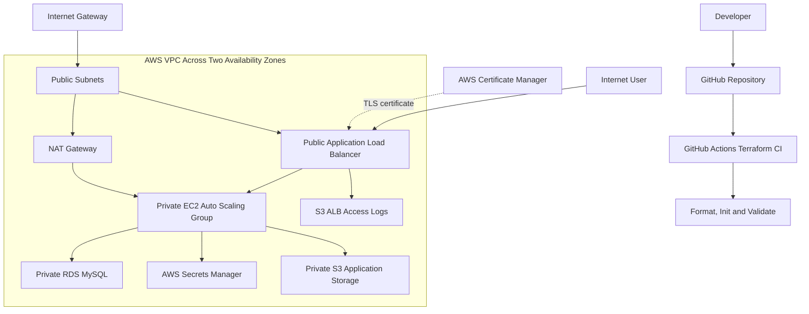

# AWS DevOps Assessment Architecture

```mermaid
flowchart TB
    DEV[Developer] --> GH[GitHub Repository]
    GH --> CI[GitHub Actions Terraform CI]
    CI --> CHECK[Format, Init and Validate]

    USER[Internet User] --> ALB[Public Application Load Balancer]
    ACM[AWS Certificate Manager] -. TLS certificate .-> ALB

    ALB --> APP[Private EC2 Auto Scaling Group]
    APP --> DB[Private RDS MySQL]
    APP --> SM[AWS Secrets Manager]

    APP --> S3[Private S3 Application Storage]
    ALB --> LOGS[S3 ALB Access Logs]

    IGW[Internet Gateway] --> PUB[Public Subnets]
    PUB --> ALB
    PUB --> NAT[NAT Gateway]
    NAT --> APP

    subgraph VPC[AWS VPC Across Two Availability Zones]
        PUB
        ALB
        APP
        DB
        NAT
        S3
        LOGS
        SM
    end
```
